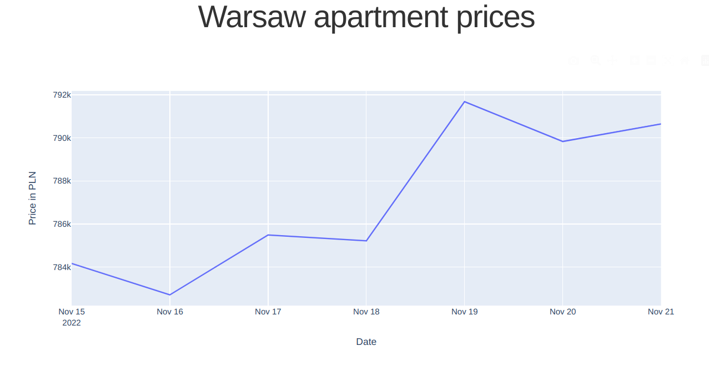
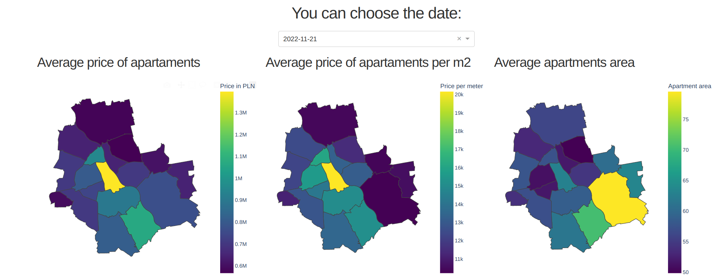

# Simple dash app about apartments prices in Warsaw
The application made in Dash generates charts based on data from database.
You can select the day to which the data relates.
You can also select a district for which other charts are to be generated.

## Data Collection 
The data is retrieved every day at midnight using a self-written python web-scraping script and is automatically sent to the mongo database.

## Examples 

